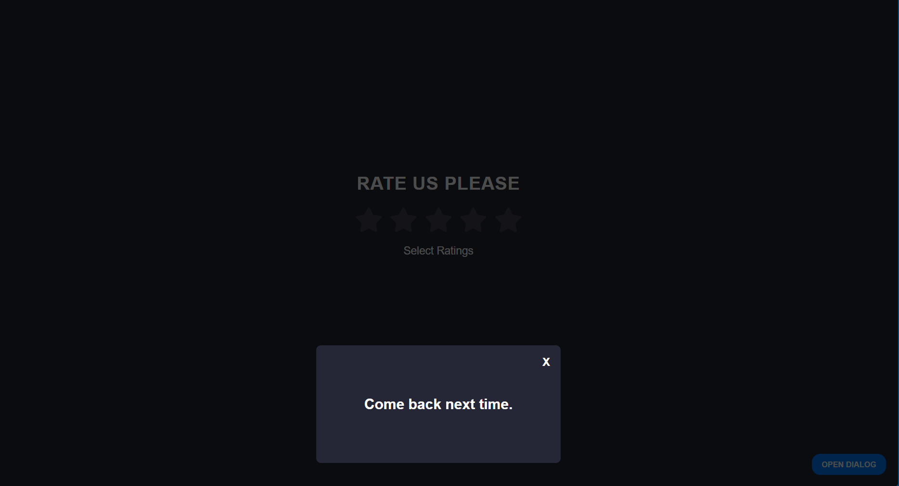

# Rating System
An interactive Star Rating application built with **React.js**. This project allows users to select a rating from 1 to 5 stars, displaying a dynamic text response based on the selection, and features a functional dialog modal.

## Features
- **Dynamic Star Rating**: Built using the `map()` method to render stars.
- **Conditional Rendering**: Displays specific feedback words (e.g., "Very Good", "Bad") based on state.
- **State Management**: Utilizes the `useState` hook for rating tracking and modal toggling.
- **Modal Dialog**: A bottom-aligned popup window with a functional close trigger.
- **Responsive Design**: Styled with CSS Flexbox for centering and layout.

## Tech Stack
- **Framework**: React (Functional Components)
- **Icons**: (FaStar)
- **Styling**: CSS (Custom properties and Flexbox)
- **Deployment**: GitHub Pages

## Author
Lateefat Obisesan

### Demo
You can access the live application [here](https://lateefat-obisesan.github.io/rating-system/)

### Preview

